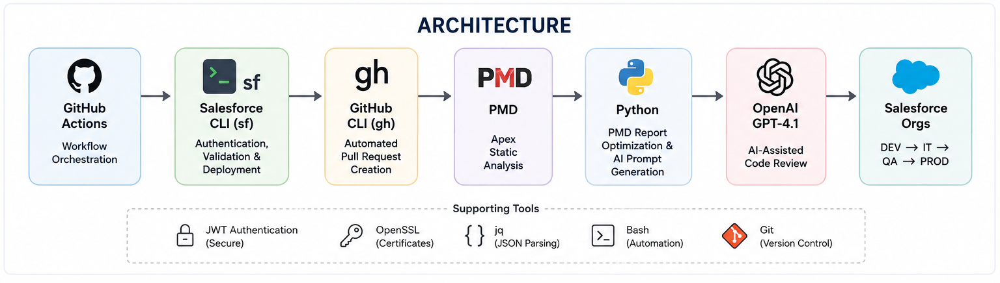
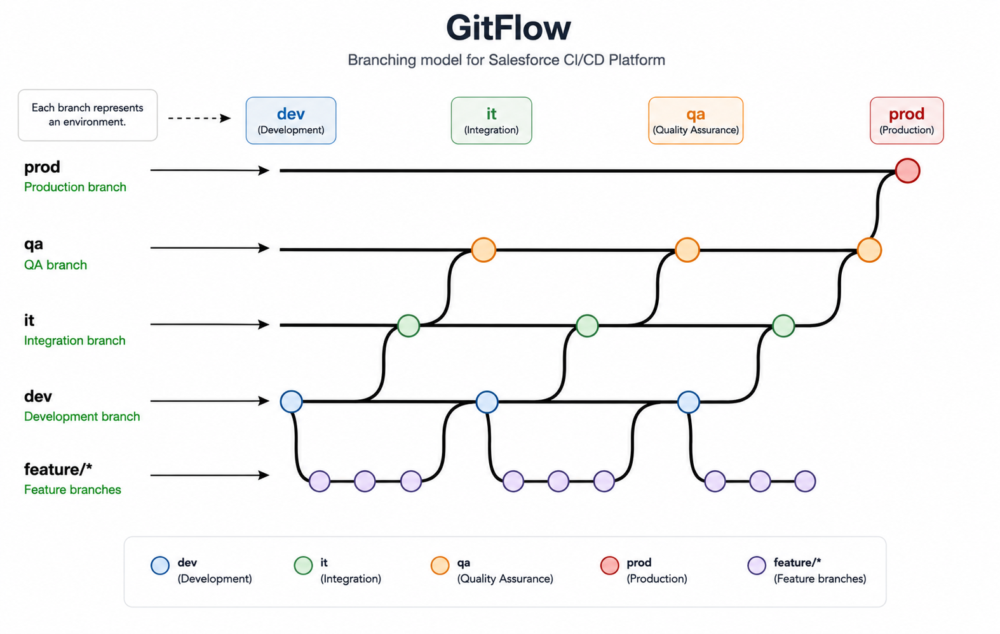
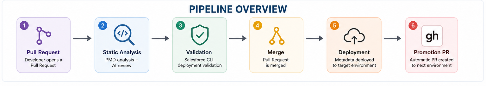
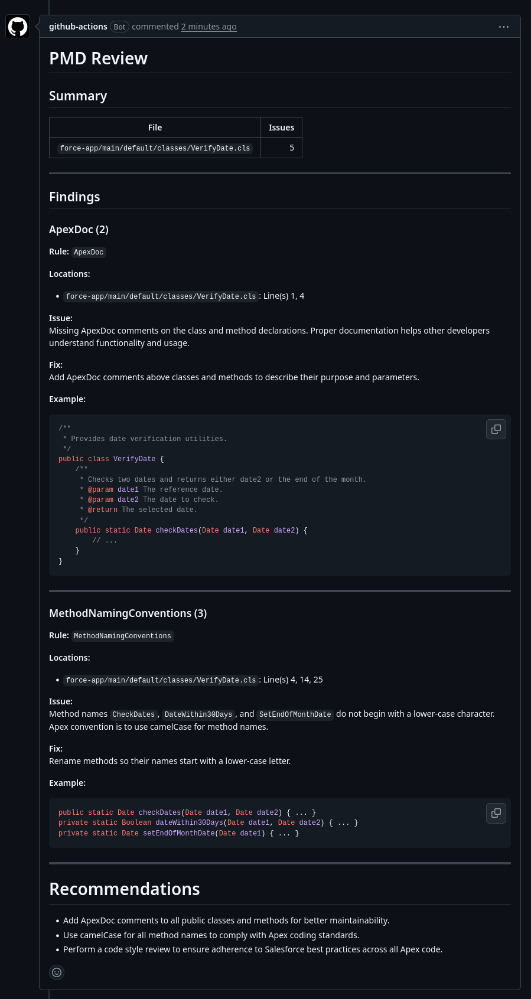
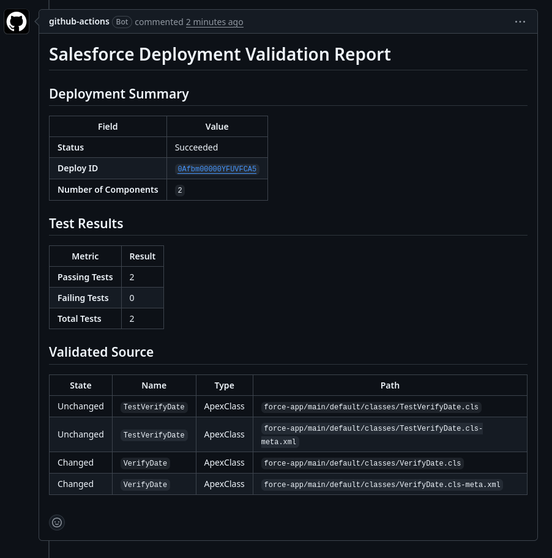

# Salesforce CI/CD Platform

A CI/CD platform for Salesforce projects built with GitHub Actions, Salesforce CLI, GitHub CLI, PMD, and AI-assisted code review.

This project was created as a learning project and portfolio piece to explore Salesforce DevOps practices, GitHub Actions automation, and AI integration into development workflows.

---

# Overview

The platform automates the complete deployment lifecycle across multiple Salesforce environments.

It performs:

- Static code analysis with PMD
- AI-assisted code review
- Deployment validation
- Metadata deployment
- Automatic environment promotion
- Secure JWT authentication
- Automated Pull Request creation

---

# Key Features

- Multi-environment pipeline (DEV → IT → QA → PROD)
- PMD static analysis for Apex
- AI review based on PMD findings
- Optimized AI prompt generation to reduce token usage
- Deployment validation using Salesforce CLI
- Automated metadata deployment
- Automatic environment promotion
- JWT Bearer Flow authentication
- Environment isolation with GitHub Environments
- Pull Request comments with validation and AI review
- Changed metadata detection for faster executions

---

# Architecture


### Main Components

- **GitHub Actions** — Workflow orchestration
- **Salesforce CLI (`sf`)** — Authentication, validation and deployment
- **GitHub CLI (`gh`)** — Automatic Pull Request creation
- **PMD** — Apex static analysis
- **Python** — PMD report optimization and AI prompt generation
- **Bash** — Deployment automation scripts

---

# GitFlow Strategy


### Responsibilities

| Branch | Purpose |
|---------|----------|
| feature/* | Development |
| dev | Development Environment |
| it | Integration Testing |
| qa | Quality Assurance |
| prod | Production |

---

# Pipeline Overview



---

# Workflows

## 1. Static Analysis

### Purpose

Analyze modified Apex metadata and provide an AI-assisted review.

### Process

- Detect changed Apex files
- Execute PMD only on modified metadata
- Generate PMD XML report
- Build optimized AI prompt
- Publish AI review as a Pull Request comment

### AI Review

The `build_prompt.py` script parses the PMD XML report and extracts only the information that is useful for the AI review.

Instead of sending the entire PMD report, it keeps only:

- Relevant violations
- Rule information
- File locations
- Surrounding code snippets

This optimized prompt significantly reduces token consumption while preserving enough context for GPT-4.1 to provide meaningful recommendations.

Outputs:

- `pmd-report.xml`
- `ai-review.md`



---

## 2. Validation

### Purpose

Validate metadata deployment against the target Salesforce environment before deployment.

### Process

- Authenticate using JWT
- Execute `sf project deploy validate`
- Use the configured Salesforce `TEST_LEVEL`
- Parse deployment results
- Publish a validation report as a Pull Request comment



---

## 3. Deployment

### Purpose

Deploy validated metadata to the target environment.

### Process

- Authenticate using JWT
- Execute `sf project deploy start`
- Deploy metadata using the configured Salesforce `TEST_LEVEL`

---

## 4. Promotion

### Purpose

Automatically promote changes between environments.

### Process

- Detect the next environment
- Create a promotion Pull Request using GitHub CLI (`gh`)
- Prevent duplicate promotion Pull Requests

Promotion flow:

```
dev -> it -> qa -> prod
```

---

# Authentication

The platform uses **JWT Bearer Flow** for secure, headless authentication.

Each environment has its own:

- Connected App
- JWT certificate
- GitHub Environment
- Secrets
- Variables

## GitHub Secrets

| Secret | Description |
|----------|-------------|
| JWT_KEY | Private key used for JWT authentication |

## GitHub Variables

| Variable | Description |
|----------|-------------|
| CONSUMER_KEY | Connected App Consumer Key |
| ORG_ALIAS | Salesforce Org Alias |
| URL | Salesforce Instance URL |
| USERNAME | Integration User |
| TEST_LEVEL | Salesforce deployment test level |

---

# Repository Structure

```text
.
├── .github
│   ├── workflows
│   └── workflows/scripts
├── config
├── force-app
├── manifest
├── scripts
├── package.json
├── sfdx-project.json
└── README.md
```

---

# Technologies

## Languages

- Apex
- Python
- Bash

## CI/CD

- GitHub Actions
- Salesforce CLI (`sf`)
- GitHub CLI (`gh`)

## Code Quality

- PMD 7.15

## AI

- OpenAI GPT-4.1
- GitHub AI Inference

## Utilities

- OpenSSL
- jq
- Git
- Prettier
- Husky

---

# Installation

## Requirements

- Git
- Node.js
- Salesforce CLI
- GitHub Account
- Salesforce Org

Clone the repository:

```bash
git clone https://github.com/your-username/salesforce-cicd-platform.git

cd salesforce-cicd-platform

npm install
```

Install Salesforce CLI:

```bash
npm install -g @salesforce/cli
```

---

# Configuration

Create a GitHub Environment for each Salesforce environment:

- dev
- it
- qa
- prod

Configure:

### Secrets

- JWT_KEY

### Variables

- CONSUMER_KEY
- USERNAME
- URL
- ORG_ALIAS
- TEST_LEVEL

---

# Future Improvements

- Custom PMD rules
- Slack / Microsoft Teams notifications
- Deployment dashboard
- Rollback workflow
- Manual production approval
- Additional metadata support

---

# License

This project is licensed under the MIT License.